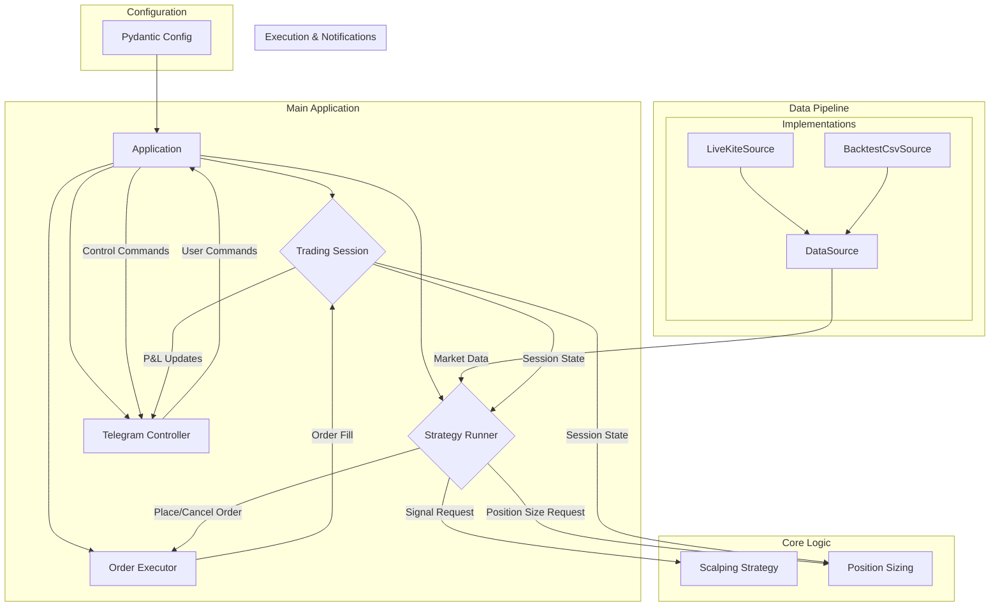

# AUDIT.md: Nifty 50 Scalper Bot

## 1. Executive Summary

This audit assesses the `nifty_scalper_bot` repository with the goal of transforming it into a production-grade, robust, and verifiably profitable trading system.

The audit has uncovered **several blocking-level issues** that prevent the bot from functioning as intended. The most critical flaw is a **fundamental disconnect between the designed strategy and the executed strategy**. The sophisticated, multi-indicator strategy is currently **unused**, and the bot is operating on a simplistic, context-free breakout logic, exposing the system to extreme risk.

Furthermore, the existing backtesting engine is **dangerously flawed** with look-ahead bias, rendering its results invalid. The core application architecture is a monolithic "God Class," making the system brittle, untestable, and difficult to maintain.

This refactoring project will address these issues by correcting the strategy execution, building a high-fidelity backtesting engine, and re-architecting the codebase for clarity, testability, and robustness.

---

## 2. Target Architecture Diagram

The current monolithic architecture will be refactored into a modular, event-driven system with clear separation of concerns, managed by a central `Application` class.

---

## 3. Per-File Audit & Remediation Plan

| Path | Issue | Severity | Fix | Status |
| --- | --- | --- | --- | --- |
| `src/main.py` | Confused process model; global `_trader` instance. | **High** | Refactor to a single `start` command managed by a central `Application` class using dependency injection. | 🚧 To Do |
| `src/config.py` | Monolithic, unstructured, no validation, redundant variables. | **High** | Replace with Pydantic-based structured config (`Trading`, `Risk`, `API`). Create `.env.example`. | 🚧 To Do |
| `src/data_streaming/realtime_trader.py` | **"God Class" Monolith.** Tightly coupled, untestable, mixes all concerns. | **Blocking** | Decompose into `StrategyRunner`, `TradingSession`, and `DataSource` abstractions. Use dependency injection. | 🚧 To Do |
| `src/strategies/scalping_strategy.py` | **Core strategy logic is unused.** Bot runs a simplistic breakout strategy without spot confirmation. | **Blocking** | Fix data pipeline to provide spot data. Change `StrategyRunner` to call the correct, score-based `generate_signal` method. | 🚧 To Do |
| `src/backtesting/backtest_engine.py` | **Look-ahead bias.** No parity with live logic. Inefficient. Unusable. | **Blocking** | Discard and build a new, high-fidelity backtest engine (`tests/true_backtest_dynamic.py`) from scratch that reuses the refactored live components. | 🚧 To Do |
| `src/utils/strike_selector.py` | `is_trading_hours` does not account for market holidays. | **Medium** | Integrate a proper market holiday calendar (e.g., `trading_calendars`). | 🚧 To Do |
| `src/utils/strike_selector.py` | Minor config coupling and error handling issues. | **Low** | Refactor to use injected config. Make error returns explicit (`None` or raise). | 🚧 To Do |
| `src/execution/order_executor.py` | Logic is embedded within `RealTimeTrader`. | **Medium** | Refactor into a standalone, testable class that manages its own state (e.g., for trailing stops). | 🚧 To Do |
| `requirements.txt` | Contains both `Flask` and `FastAPI`. | **Low** | Investigate usage of the health check endpoint and remove the unused web framework. | 🚧 To Do |
| `(Root)` | Missing `AUDIT.md`, `CHANGELOG.md`, `RUNBOOK.md`. | **Medium** | Create and populate these documents. | 🚧 To Do |

---

## 4. Risk Controls Checklist

This checklist evaluates the risk management features as required by the prompt.

| Control | Status | Recommendation |
| --- | --- | --- |
| **Pre-Trade** | | |
| High-Confidence Gate (≥9 conditions) | ❌ **Fail** | Implement by fixing the strategy execution to use the score-based `generate_signal` method.
| Structured SL/TP (ATR-based) | ❌ **Fail** | The correct strategy logic that calculates this is unused. Will be fixed. |
| Position Sizing (ATR/Volatility-based) | ❌ **Fail** | The `PositionSizing` class appears disconnected. Will be properly integrated. |
| Strike Selection (ATM/OTM) | ✅ **Pass** | Logic in `strike_selector.py` is sound. |
| Spread/Slippage Guard | ⚠️ **Partial** | Logic exists but appears incomplete/bypassed. Needs to be fully implemented and verified. |
| Duplicate Order Protection | ✅ **Pass** | The strategy file has a de-duplication hash. Can be made more robust. |
| **Intra-Trade** | | |
| Trailing Stop-Loss | ⚠️ **Partial** | Logic exists in `RealTimeTrader` but is untestable. Will be refactored into `OrderExecutor`. |
| Partial Take-Profit | ⚠️ **Partial** | Config exists, but logic is untestable. Will be refactored. |
| **Session-Level** | | |
| Max Daily Drawdown Limit | ⚠️ **Partial** | Logic exists but is untestable and has confusing config. Will be refactored into `TradingSession`. |
| 3-Loss Shutdown | ⚠️ **Partial** | A "loss cooldown" exists. Will be hardened to a strict 3-loss shutdown rule. |
| Max Trades Per Day | ✅ **Pass** | Configurable parameter exists. |
| IST Market Hours Window | ⚠️ **Partial** | Does not account for holidays. Will be fixed. |

---

## 5. Deployment Checklist (Render/Railway)

| Item | Status | Action |
| --- | --- | --- |
| `.env.example` | ❌ **Fail** | Create a definitive `.env.example` based on the new Pydantic config. |
| `Dockerfile` | ✅ **Pass** | A `Dockerfile` exists. Will be reviewed and optimized (e.g., multi-stage build). |
| `render.yaml` / `Procfile` | ✅ **Pass** | Files exist. Commands will be updated post-refactor. |
| Start Command (`python3 -m src.main start`) | ⚠️ **Partial** | Entry point will be refactored to a clean `start` command. |
| Health Check Endpoint | ✅ **Pass** | A health check server exists. Will be verified. |
| Structured Logging (JSON) | ❌ **Fail** | Implement structured logging for better monitoring. |
| Secrets Management | ✅ **Pass** | Bot correctly uses environment variables for secrets. |
| CI/CD (`ruff`, `mypy`, `pytest`) | ❌ **Fail** | Create GitHub Actions workflow to automate checks. |
